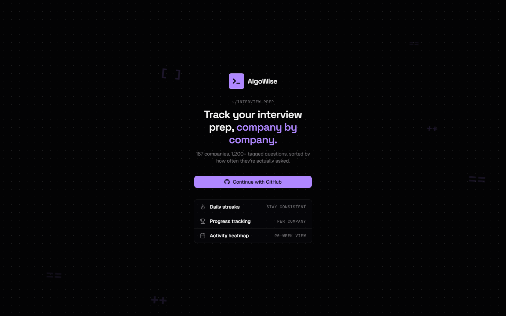
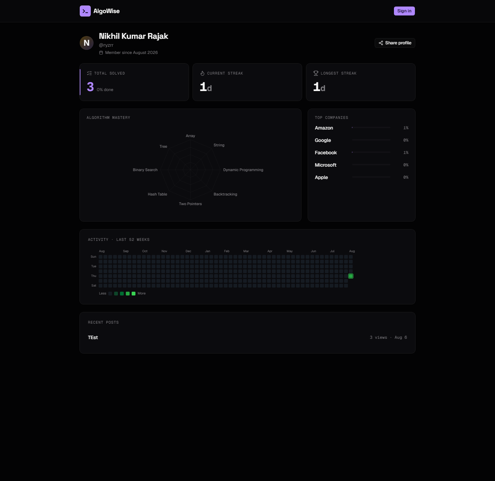

# AlgoWise

**Track your technical interview prep, company by company.**

AlgoWise turns a public LeetCode company↔question dataset into a personalized prep system: track solved problems per company, get spaced-repetition review reminders, duel another user 1v1 on a live coding problem, run a scripted mock-interview simulation, and see exactly how far you are from being "ready" for a specific company.

[**Live demo →** algowise-bice.vercel.app](https://algowise-bice.vercel.app)

---

## Screenshots

**Sign-in**



**Public profile** — shareable stats page (`/u/<username>`), no login required to view



---

## What it does

- **Company-wise problem tracking** — browse 187 companies and 1,263+ tagged problems, sorted by how often each is actually asked, with per-problem status, starring, and Markdown notes.
- **Spaced-repetition review** — an Ebbinghaus forgetting-curve scheduler queues solved problems for re-review at increasing intervals, tuned per difficulty.
- **Company Match Score** — a scoring engine that compares your solved-problem coverage, difficulty distribution, and topic mix against a company's actual question set, and tells you which topics to close the gap on.
- **War Room** — real-time 1v1 coding duels. Pick a problem, race an opponent, and run your code in a real in-browser editor (8 languages) without either of you needing a local dev environment.
- **Story Mode** — a 4-stage scripted mock interview (Recruiter Screen → Phone Screen → 2 Onsite rounds) with per-stage timers and a weak-topic diagnosis if you fail.
- **Blind Mode** — a guess-the-company minigame that tests pattern recognition across companies' question sets.
- **Daily challenge, streaks, and 23 achievements** to build a consistency habit.
- **Community forum** — Markdown blog/question posts, nested comments, accepted answers, likes, and tags.
- **Mentor Connect** — self-declared mentors receive async feedback requests from other users.
- **Prep events** — hosted events with RSVP capacity limits.
- **LeetCode import** — pull your recent accepted submissions from LeetCode's public API and sync solved status automatically.
- **Weekly email digest** — a rendered HTML summary of your week (solved count, streak, weakest/strongest topics, due-for-review count), sent via Resend on a schedule.
- **Public shareable profile** — a `/u/<username>` page anyone can view, showing your stats, radar chart, activity heatmap, and recent posts.

## Tech stack

| Layer | Choice |
|---|---|
| Framework | Next.js 16 (App Router), React 19, TypeScript |
| Database | PostgreSQL ([Neon](https://neon.tech)), via Prisma ORM |
| Auth | NextAuth.js v5 (GitHub OAuth, database sessions) |
| Real-time | [Pusher Channels](https://pusher.com) (War Room duels), with a client-side polling fallback when unconfigured |
| Code execution | [Piston](https://github.com/engineer-man/piston) — public, keyless code-execution API |
| Email | [Resend](https://resend.com) |
| Charts | Recharts |
| Editor | Monaco |
| Styling | Tailwind CSS v4 |
| Deployment | Vercel, with Vercel Cron for the weekly digest |

Nothing here needs a separately hosted backend service — server actions and API routes inside the Next.js app do all of the work; Postgres, Pusher, Resend, and Piston are the only external dependencies, and each is a managed/hosted service with a usable free tier.

## Data source

The company↔question dataset comes from [hxu296/leetcode-company-wise-problems-2022](https://github.com/hxu296/leetcode-company-wise-problems-2022) (MIT licensed). Problem metadata (difficulty, acceptance rate, paid-only status) is fetched from LeetCode's public `problems/all` endpoint at import time. Full attribution and license text: [ATTRIBUTION.md](ATTRIBUTION.md).

## Getting started

### Prerequisites

- Node.js 20+
- A [Neon](https://neon.tech) (or any Postgres) database
- A [GitHub OAuth App](https://github.com/settings/developers) for sign-in

### Setup

```bash
git clone https://github.com/ryzrr/algowise.git
cd algowise
npm install
```

Copy the environment variables below into `.env` (for `DATABASE_URL`/`DIRECT_URL`, which Prisma's CLI reads) and `.env.local` (for everything else, which Next.js loads at runtime):

| Variable | Required | Description |
|---|---|---|
| `DATABASE_URL` | yes | Postgres connection string (pooled, if your provider offers one) |
| `DIRECT_URL` | yes | Postgres connection string (direct/unpooled — used for migrations) |
| `AUTH_SECRET` | yes | Random secret for NextAuth — generate with `npx auth secret` |
| `AUTH_GITHUB_ID` / `AUTH_GITHUB_SECRET` | yes | From your GitHub OAuth App |
| `PUSHER_APP_ID` / `NEXT_PUBLIC_PUSHER_KEY` / `PUSHER_SECRET` / `NEXT_PUBLIC_PUSHER_CLUSTER` | no | War Room real-time; falls back to polling if unset |
| `RESEND_API_KEY` / `DIGEST_FROM_EMAIL` | no | Weekly digest email; sending no-ops safely if unset |
| `CRON_SECRET` | no | Protects the digest cron route from public calls |
| `NEXT_PUBLIC_APP_URL` | no | Used to build links inside the digest email; defaults to `http://localhost:3000` |

Set up the database and seed the problem catalog:

```bash
npx prisma migrate dev
npm run import-data
```

Run it:

```bash
npm run dev
```

### Deploying

The app deploys to Vercel with no special configuration — import the repo, add the environment variables above, and deploy. The included `vercel.json` registers the weekly digest as a [Vercel Cron Job](https://vercel.com/docs/cron-jobs), which authenticates automatically using `CRON_SECRET`.

## License

[PolyForm Noncommercial License 1.0.0](LICENSE) — free to use, copy, modify, and share for noncommercial purposes. Commercial use is not permitted.
